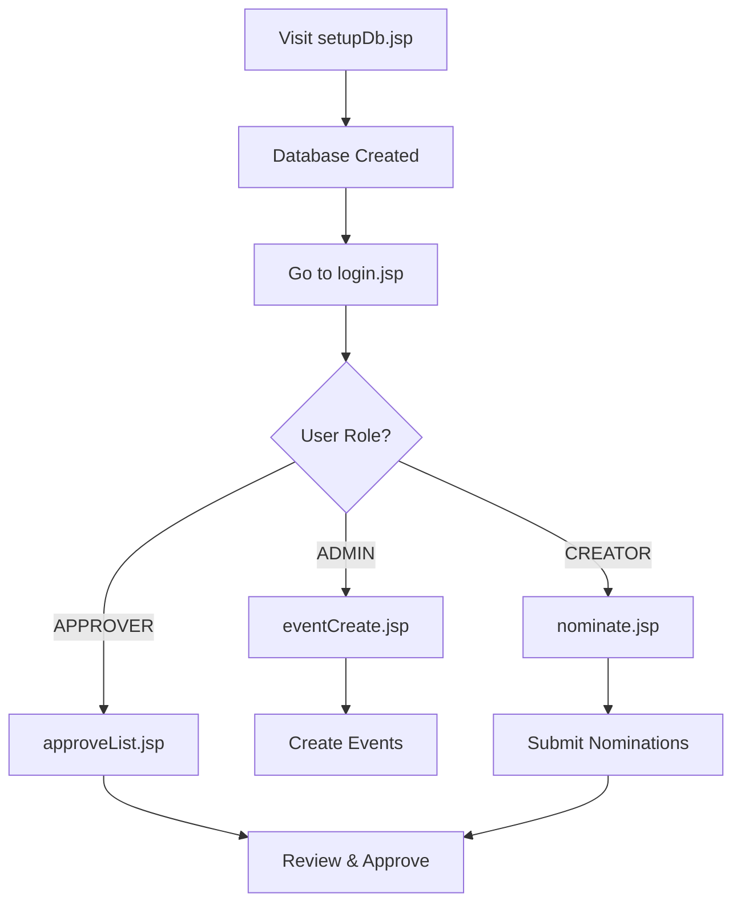

# 🎪 Event Nomination System (Legacy JSP Application)

> **A realistic pure JSP legacy application with zero Java classes - perfect for brownfield modernization exercises with GitHub Copilot.**

A circa-2010 employee event nomination system built entirely with JSP scriptlets. This represents the ultimate legacy challenge - extracting clean architecture from complete chaos.

---

## 🚀 Quick Start (One-Click Setup)

**Option 1: Right-click `SETUP.ps1` → Run with PowerShell**

**Option 2: From PowerShell:**
```powershell
cd Legacy_event_app\event
.\SETUP.ps1
```

**Note:** Use `.\` prefix - PowerShell requires it for local scripts.

This automatically:
- ✅ Checks Java & Maven (installs if missing via Chocolatey)
- ✅ Builds the project
- ✅ Starts the server
- ✅ Opens browser to setup database
- ✅ Opens login page

**Manual Setup:**
```powershell
mvn clean package
mvn jetty:run
# Then open: http://localhost:8080/event/setupDb.jsp
```

---

## 👥 Test Users

| Username | Password | Role | Access |
|----------|----------|------|--------|
| `admin` | `admin` | ADMIN | Create/manage events |
| `emp1` | `emp1` | CREATOR | Submit nominations |
| `approver` | `approver` | APPROVER | Approve/reject nominations |

---

## 📚 Workshop Materials

**Follow these in order:**

1. **[SETUP-GUIDE.md](SETUP-GUIDE.md)** - Detailed setup steps
2. **[../../EVENT-APP-EXERCISES.md](../../EVENT-APP-EXERCISES.md)** - 9 modernization exercises

**What You'll Learn:**
- Extract Model classes from JSP
- Create Repository pattern
- Implement Servlets (MVC)
- Fix security vulnerabilities
- Add validation framework
- Generate unit tests
- Optional: Migrate to Spring Boot

---

## 🎯 Business Domain

An employee event nomination system with three roles:

1. **ADMIN** → Creates company events (picnics, training, etc.)
2. **CREATOR** → Nominates self or family members for events
3. **APPROVER** → Reviews and approves/rejects nominations

---

## 🛠️ Technology Stack

| Component | Technology | Notes |
|-----------|-----------|-------|
| **Frontend** | JSP 2.3 | With embedded Java scriptlets |
| **Backend** | JSP Scriptlets | NO servlets! NO Java classes! |
| **Database** | SQLite | File-based, in WEB-INF |
| **Build** | Maven | With Jetty plugin |
| **Server** | Jetty 9.x | Embedded via maven |

---

## 📁 Project Structure

```
event/
├── SETUP.ps1                  # One-click setup script
├── SETUP-GUIDE.md            # Detailed setup instructions
├── pom.xml                   # Maven configuration
├── web/                      # All JSP pages (everything is here!)
│   ├── login.jsp            # Authentication in JSP!
│   ├── eventCreate.jsp      # Create events (ADMIN)
│   ├── nominate.jsp         # Submit nominations (CREATOR)
│   ├── approveList.jsp      # Review nominations (APPROVER)
│   └── setupDb.jsp          # Database initialization
├── src/                      # Empty! Create Java classes here during exercises
└── .vscode/                  # VS Code configuration
```

---

## 🐛 Intentional Legacy Problems

This app is a **goldmine of issues** for learning:

### Critical Issues
- ❌ **No Java Classes** - Everything in JSP scriptlets
- ❌ **Plain Text Passwords** - No hashing
- ❌ **No MVC Separation** - Business logic + Data access + UI all mixed
- ❌ **Database Code Duplicated** - Connection logic in every JSP
- ❌ **No Error Handling** - Silent failures
- ❌ **No Validation** - Bad data can be inserted
- ❌ **Security Vulnerabilities** - SQL injection risks, no CSRF protection

**Your mission**: Fix these using GitHub Copilot!

---

---

## 🔧 Troubleshooting

**Port 8080 in use:**
```powershell
netstat -ano | findstr :8080
taskkill /PID <PID> /F
```

**Build fails:**
```powershell
mvn clean -U
```

**Server won't stop:**
```powershell
Get-Process java | Stop-Process -Force
```

---

## 📚 Next Steps

1. ✅ Complete setup with SETUP.ps1
2. ✅ Test all three user roles
3. ✅ Read [SETUP-GUIDE.md](SETUP-GUIDE.md) for detailed PowerShell steps
4. ✅ Open VS Code: `code .`
5. ✅ Start exercises: [../../EVENT-APP-EXERCISES.md](../../EVENT-APP-EXERCISES.md)

---

## 🎓 Learning Objectives

By completing the exercises, you'll:
- ✅ Analyze legacy code with AI assistance
- ✅ Extract clean architecture from chaos
- ✅ Implement MVC pattern with Servlets
- ✅ Apply Repository and Service patterns
- ✅ Fix security vulnerabilities
- ✅ Add comprehensive validation
- ✅ Generate unit tests for legacy code
- ✅ Migrate to modern Spring Boot (optional)

---

**Ready to modernize legacy code? Run SETUP.ps1 and let's begin! 🚀**

1. **Exercise 1:** Analyze Pure JSP Architecture (30 min)
   - Use Copilot to identify all problems
   - Create technical debt document

2. **Exercise 2:** Extract Model Classes (45 min)
   - Create User, Event, Nomination POJOs
   - First step toward structure

3. **Exercise 3:** Create Database Utility (30 min)
   - Centralize connection management
   - Extract SQL queries to constants

4. **Exercise 4:** Extract to Servlets (60 min)
   - Move business logic out of JSP
   - Create servlet layer

5. **Exercise 5:** Implement Repository Pattern (60 min)
   - Separate data access completely
   - Clean architecture emerges

6. **Exercise 6:** Fix Security (45 min)
   - Hash passwords with BCrypt
   - Add CSRF protection
   - Input validation

7. **Exercise 7:** Add Validation (30 min)
   - Comprehensive validation framework
   - Meaningful error messages

8. **Exercise 8:** Generate Tests (60 min)
   - Unit tests for all layers
   - 70%+ coverage

9. **Exercise 9:** Spring Boot Migration (3-4 hours, Optional)
   - Complete modernization
   - JPA, Spring Security, Thymeleaf

---

## 🆘 Common Issues

### Port 8080 Already in Use

**Windows:**
```powershell
netstat -ano | findstr :8080
taskkill /PID <PID> /F
```

**Mac/Linux:**
```bash
lsof -ti:8080 | xargs kill -9
```

### Maven Build Fails

```powershell
# Clear Maven cache
rm -rf ~/.m2/repository
mvn clean install
```

### Database Not Found

Make sure you've visited `http://localhost:8080/event/setupDb.jsp` first!

### Cannot Login

- Check if database was initialized
- Default users: `admin/admin`, `emp1/emp1`, `approver/approver`
- Passwords are case-sensitive

---

## 📊 Application Workflow



---

## 🔧 VS Code Setup

### Recommended Extensions

- **Java Extension Pack** - Language support
- **Tomcat for Java** - Alternative to Jetty
- **Thunder Client** - Test endpoints
- **SQLite Viewer** - Inspect database
- **GitHub Copilot** - AI pair programmer

### VS Code Tasks

The project includes Maven integration. Use:
- `Ctrl+Shift+P` → "Maven: Execute commands"
- Or use terminal: `mvn jetty:run`

---

## 🎯 Success Criteria

After modernization exercises, your application should have:

✅ Model classes (User, Event, Nomination)  
✅ Repository layer with interfaces  
✅ Servlet controllers (no logic in JSP)  
✅ Security (hashed passwords, CSRF, validation)  
✅ Comprehensive unit tests (70%+ coverage)  
✅ Clean separation of concerns  
✅ Modern Spring Boot architecture (optional)  

---

## 📚 Additional Resources

- [JSP Best Practices](https://www.oracle.com/java/technologies/jsp-best-practices.html)
- [MVC Pattern](https://www.tutorialspoint.com/design_pattern/mvc_pattern.htm)
- [Repository Pattern](https://martinfowler.com/eaaCatalog/repository.html)
- [Spring Boot Guide](https://spring.io/guides)

---

## 🤝 Contributing

This is a learning resource. Improvements welcome! Areas:
- Additional exercise variations
- More comprehensive examples
- Bug fixes
- Documentation improvements

---

<div align="center">

**Ready to Transform Pure JSP to Clean Architecture?** 🚀

[View Exercises](../../EVENT-APP-EXERCISES.md) | [Main README](../../README.md) | [Report Issue](../../issues)

Made with ❤️ for legacy modernization training

</div>
