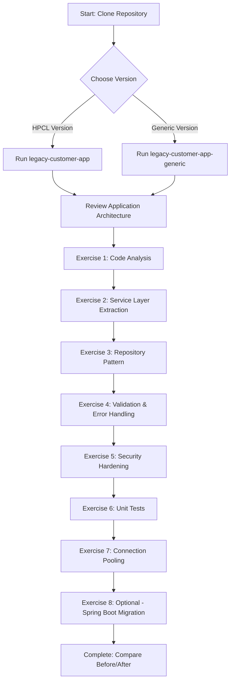

# 🏭 Legacy Code Migration Workshop with GitHub Copilot

[](https://www.oracle.com/java/)
[](https://maven.apache.org/)
[](LICENSE)

> **A hands-on workshop demonstrating brownfield legacy application modernization using GitHub Copilot and AI-assisted refactoring techniques.**

This repository contains a realistic legacy JSP/Servlet application with intentional technical debt, perfect for practicing modernization strategies with GitHub Copilot's assistance.

---
# Agenda 

## 🎪 Event Nomination System Lab

A separate pure JSP application (zero Java classes!) for advanced modernization exercises.

### Quick Access
- **Setup Guide**: [Legacy_event_app/event/VSCODE-SETUP.md](Legacy_event_app/event/VSCODE-SETUP.md)
- **Exercises**: [EVENT-APP-EXERCISES.md](EVENT-APP-EXERCISES.md)

#### Step 1: Install Prerequisites

**1.1 Install Java JDK 11+**
- Download: [https://adoptium.net/](https://adoptium.net/)
- Windows: Run installer, ensure "Add to PATH" is checked
- Verify installation:
  ```powershell
  java -version
  # Should show: openjdk version "11.x.x" or higher
  ```

**1.2 Install Maven**
- Download: [https://maven.apache.org/download.cgi](https://maven.apache.org/download.cgi)
- Windows: 
  1. Extract to `C:\Program Files\Apache\maven`
  2. Add to PATH: `C:\Program Files\Apache\maven\bin`
  3. Set `JAVA_HOME` environment variable to JDK path
- Verify:
  ```powershell
  mvn -version
  # Should show Maven version and Java version
  ```

**1.3 Install VS Code**
- Download: [https://code.visualstudio.com/](https://code.visualstudio.com/)
- Install with default settings

**1.4 Install VS Code Extensions**
- Open VS Code → Extensions (Ctrl+Shift+X)
- Install:
  1. **Extension Pack for Java** (by Microsoft)
  2. **GitHub Copilot** + **GitHub Copilot Chat**
  3. **Maven for Java** (usually included in Java pack)

#### Step 2: Open Project in VS Code

```powershell
# Navigate to the event app folder
cd Legacy_event_app\event

# Open in VS Code
code .
```

VS Code will prompt to install recommended extensions - click "Install All"

#### Step 3: Build the Application

Open VS Code integrated terminal (`Ctrl+\`` or View → Terminal):

```powershell
# Clean any previous builds
mvn clean

# Compile and package
mvn package

# This should show "BUILD SUCCESS"
```

**If you see errors:**
- Java not found: Restart terminal after installing Java
- Maven not found: Check PATH environment variable
- Compilation errors: These are expected - the app has no Java classes yet!

#### Step 4: Start the Server

```powershell
mvn jetty:run
```

Wait for message: `[INFO] Started Jetty Server`

**Alternative - Use VS Code Tasks:**
- Press `Ctrl+Shift+P`
- Type "Tasks: Run Task"
- Select "Maven: Run Jetty Server"

#### Step 5: Initialize Database

1. Open browser to: **http://localhost:8080/event/setupDb.jsp**
2. You should see: "Database setup successful!"
3. This creates `build/web/WEB-INF/event.db` (SQLite database)

#### Step 6: Test the Application

1. Navigate to: **http://localhost:8080/event/login.jsp**
2. Login with one of these accounts:

| Username | Password | Role | Capabilities |
|----------|----------|------|-------------|
| `admin` | `admin` | ADMIN | Create events |
| `emp1` | `emp1` | CREATOR | Nominate for events |
| `approver` | `approver` | APPROVER | Approve nominations |

3. Test basic functionality:
   - **As admin**: Create an event at home page
   - **As emp1**: Nominate yourself for an event
   - **As approver**: View and approve nominations

#### Step 7: Explore the Code

Open these files to understand the legacy structure:

```
Legacy_event_app/event/
├── web/
│   ├── login.jsp          # Authentication logic
│   ├── eventCreate.jsp    # Admin: Create events
│   ├── nominate.jsp       # Employee: Submit nominations
│   └── approveList.jsp    # Approver: Review nominations
├── pom.xml                # Maven dependencies
└── .vscode/
    ├── tasks.json         # Pre-configured build tasks
    └── extensions.json    # Recommended extensions
```

#### Step 8: Start the Exercises

Follow the detailed exercises in: [EVENT-APP-EXERCISES.md](EVENT-APP-EXERCISES.md)

**Exercise Overview:**

1. **Exercise 1** (30-40 min): Analyze Pure JSP Architecture
   - Use Copilot to identify MVC violations
   - Document technical debt
   - Understand security issues

2. **Exercise 2** (45-60 min): Extract Model Classes
   - Create User, Event, Nomination POJOs
   - Implement proper encapsulation
   - Add validation logic

3. **Exercise 3** (30-45 min): Create Database Utility
   - Extract connection management
   - Implement connection pooling
   - Add error handling

4. **Exercise 4** (60-90 min): Extract Business Logic to Servlets
   - Create LoginServlet, NominationServlet
   - Implement servlet lifecycle
   - Move logic out of JSPs

5. **Exercise 5** (45-60 min): Implement Repository Pattern
   - Create UserRepository, EventRepository
   - Implement CRUD operations
   - Separate data access layer

6. **Exercise 6** (60-75 min): Fix Security Vulnerabilities
   - Hash passwords with BCrypt
   - Add input validation
   - Implement CSRF protection

7. **Exercise 7** (45-60 min): Add Validation Framework
   - Create custom validators
   - Add server-side validation
   - Improve error messages

8. **Exercise 8** (60-90 min): Generate Unit Tests
   - Create JUnit test classes
   - Mock database dependencies
   - Achieve 70%+ code coverage

9. **Exercise 9** (2-3 hours): Spring Boot Migration (Optional)
   - Convert to Spring Boot application
   - Use Spring Data JPA
   - Implement REST APIs

### Common Issues and Solutions

**Issue: Java not found**
```powershell
# Check if Java is installed
java -version

# If not found, add to PATH (Windows):
# System Properties → Environment Variables → PATH
# Add: C:\Program Files\Java\jdk-11\bin
```

**Issue: Maven not found**
```powershell
# Check Maven installation
mvn -version

# Download from maven.apache.org
# Add bin folder to PATH
```

**Issue: Port 8080 already in use**
```powershell
# Find process using port 8080
netstat -ano | findstr :8080

# Kill the process
taskkill /PID <process_id> /F

# Or change port in pom.xml
```

**Issue: Database not created**
- Manually browse to: http://localhost:8080/event/setupDb.jsp
- Check console for errors
- Verify write permissions in `build/web/WEB-INF/` folder

**Issue: VS Code Java extension not working**
```powershell
# Clean Java Language Server workspace
Ctrl+Shift+P → "Java: Clean Java Language Server Workspace"

# Restart VS Code
```

--- 


## 📚 Table of Contents

- [Overview](#-overview)
- [Quick Start](#-quick-start)
- [Workshop Structure](#-workshop-structure)
- [Prerequisites](#-prerequisites)
- [Learning Objectives](#-learning-objectives)
- [Repository Structure](#-repository-structure)
- [Getting Help](#-getting-help)
- [Contributing](#-contributing)

---

## 🎯 Overview

This workshop teaches you how to leverage **GitHub Copilot** to modernize legacy enterprise applications. The repository contains **two versions** of a legacy customer management system:

1. **HPCL Version** (`legacy-customer-app/`) - Industry-specific implementation with HPCL branding
2. **Generic Version** (`legacy-customer-app-generic/`) - Adaptable template with `com.example` package structure

Both are circa-2010 Java web applications containing common legacy code problems found in real-world brownfield projects.

### What You'll Learn

- 🔍 **Analyze legacy code** using AI-powered insights
- 🏗️ **Refactor monolithic servlets** into clean architecture patterns
- 🛡️ **Fix security vulnerabilities** with Copilot's suggestions
- 🚀 **Modernize technology stack** (JSP/Servlet → Spring Boot)
- 📊 **Document technical debt** automatically
- 🧪 **Generate unit tests** for legacy code
- 🔄 **Implement migration strategies** incrementally

---

## 🚀 Quick Start

### Choose Your Version

#### Option 1: HPCL Version (Industry-Specific)

**Windows:**
```powershell
cd legacy-customer-app
.\RUN-LEGACY-APP.ps1
```

**Mac/Linux:**
```bash
cd legacy-customer-app
chmod +x RUN-LEGACY-APP.sh
./RUN-LEGACY-APP.sh
```

#### Option 2: Generic Version (Adaptable Template)

**Windows:**
```powershell
cd legacy-customer-app-generic
.\RUN-APP.ps1
```

**Mac/Linux:**
```bash
cd legacy-customer-app-generic
chmod +x RUN-APP.sh
./RUN-APP.sh
```

The application will:
1. ✅ Build the Maven project
2. ✅ Start Jetty server on port 8080
3. ✅ Auto-open browser to http://localhost:8080/legacy

### Manual Setup (If Needed)

```powershell
# Navigate to project
cd legacy-customer-app

# Install dependencies & build
mvn clean package

# Run the application
mvn jetty:run

# Access at http://localhost:8080/legacy
```

---

## 📖 Workshop Structure

### 1️⃣ **Legacy Applications** (Choose One)

#### HPCL Version (`legacy-customer-app/`)
- Industry-specific implementation
- Package: `com.hpcl.legacy`
- Sample data: Indian Oil companies
- **Best for:** Realistic industry scenario practice

**See:** [HPCL App README](legacy-customer-app/README.md) | [HPCL Exercises](BROWNFIELD-EXERCISES.md)

#### Generic Version (`legacy-customer-app-generic/`)
- Adaptable template
- Package: `com.example.legacy`
- Sample data: Generic corporations
- **Best for:** Customizable training for any organization

**See:** [Generic App README](legacy-customer-app-generic/README.md) | [Generic Exercises](GENERIC-EXERCISES.md)

**Both versions include:**
- Java Servlets 4.0
- JSP 2.3 & JSTL 1.2
- JDBC (direct database access)
- H2 In-Memory Database
- Bootstrap 4.6 & jQuery 3.6

### 2️⃣ **Guided Exercises**

Two comprehensive exercise sets tailored to each version:

**HPCL Exercises** (`BROWNFIELD-EXERCISES.md`)
- Industry-specific scenarios
- HPCL branding and context
- Oil & Gas industry examples

**Generic Exercises** (`GENERIC-EXERCISES.md`)
- Universal modernization patterns
- Customizable for any organization
- 8 progressive exercises with Spring Boot migration

**Both include:**
1. Code Analysis & Documentation
2. Service Layer Extraction
3. Repository Pattern Implementation
4. Validation & Error Handling
5. Security Hardening
6. Unit Test Generation
7. Connection Pooling
8. Spring Boot Migration (optional)

---

## ✅ Prerequisites

### Required Software

| Tool | Version | Purpose |
|------|---------|---------|
| **Java JDK** | 11+ | Runtime & compilation |
| **Maven** | 3.6+ | Build & dependency management |
| **VS Code/IntelliJ** | Latest | IDE with Copilot support |
| **GitHub Copilot** | Active subscription | AI pair programmer |
| **Git** | 2.x+ | Version control |

### Verify Installation

```powershell
# Check Java
java -version
# Should show: openjdk version "11" or higher

# Check Maven
mvn -version
# Should show: Apache Maven 3.6.x or higher

# Check Git
git --version
# Should show: git version 2.x.x
```

### Enable GitHub Copilot

1. Install [GitHub Copilot Extension](https://marketplace.visualstudio.com/items?itemName=GitHub.copilot) for VS Code
2. Sign in with your GitHub account
3. Verify Copilot is active (look for icon in status bar)

---

## 🎓 Learning Objectives

By completing this workshop, you will:

- ✅ **Understand legacy code patterns** and anti-patterns common in enterprise apps
- ✅ **Use GitHub Copilot** effectively for code analysis and refactoring
- ✅ **Apply clean architecture** principles to legacy codebases
- ✅ **Implement repository pattern** replacing direct JDBC calls
- ✅ **Add proper validation** and exception handling
- ✅ **Generate meaningful tests** with AI assistance
- ✅ **Document technical debt** and create modernization roadmaps
- ✅ **Practice incremental migration** strategies

---

## 📂 Repository Structure

```
LegacyCodeMigration-Github-Copilot-brownfield/
│
├── README.md                          # 👈 You are here - Main documentation
│
├── BROWNFIELD-EXERCISES.md            # HPCL-specific exercises
├── GENERIC-EXERCISES.md               # Generic version exercises
│
├── legacy-customer-app/               # HPCL Version
│   ├── README.md                      # HPCL app documentation
│   ├── pom.xml                        # Maven configuration
│   ├── RUN-LEGACY-APP.ps1             # Windows launcher
│   ├── RUN-LEGACY-APP.sh              # Mac/Linux launcher
│   └── src/main/
│       ├── java/com/hpcl/legacy/      # HPCL package structure
│       │   ├── model/Customer.java
│       │   ├── servlet/
│       │   └── util/DBConnection.java
│       └── webapp/
│           ├── WEB-INF/web.xml
│           ├── index.jsp
│           └── jsp/                   # JSP views
│
└── legacy-customer-app-generic/       # Generic Version
    ├── README.md                      # Generic app documentation
    ├── pom.xml                        # Maven configuration
    ├── RUN-APP.ps1                    # Windows launcher
    ├── RUN-APP.sh                     # Mac/Linux launcher
    └── src/main/
        ├── java/com/example/legacy/   # Generic package structure
        │   ├── model/Customer.java
        │   ├── servlet/
        │   └── util/DBConnection.java
        └── webapp/
            ├── WEB-INF/web.xml
            ├── index.jsp
            └── jsp/                   # JSP views
```

---

## 🏆 Workshop Path

### Recommended Learning Path



### Time Estimates

- **Quick Demo**: 30-40 minutes (Exercise 1 only)
- **Core Workshop**: 3-4 hours (Exercises 1-6)
- **Full Workshop**: 5-7 hours (Exercises 1-7)
- **Complete Migration**: 7-9 hours (All exercises including Spring Boot)

---

## 🆘 Getting Help

### Common Issues

#### Port 8080 Already in Use
```powershell
# Windows: Find and kill process
netstat -ano | findstr :8080
taskkill /PID <PID> /F

# Mac/Linux
lsof -ti:8080 | xargs kill -9
```

#### Maven Build Fails
```powershell
# Clear cache and rebuild
mvn clean
rm -rf ~/.m2/repository
mvn install
```

#### Java Version Mismatch
```powershell
# Check JAVA_HOME
echo $env:JAVA_HOME

# Set to correct JDK
$env:JAVA_HOME = "C:\Program Files\Java\jdk-11"
```

### Support Channels

#### Documentation
- 🏭 **HPCL Version**: [HPCL App README](legacy-customer-app/README.md) | [HPCL Exercises](BROWNFIELD-EXERCISES.md)
- 🏛️ **Generic Version**: [Generic App README](legacy-customer-app-generic/README.md) | [Generic Exercises](GENERIC-EXERCISES.md)

#### Help & Community
- 💬 **Issues**: Create a GitHub issue for bugs or questions
- 🤝 **Discussions**: Use GitHub Discussions for general questions
- 📚 **GitHub Copilot Help**: [Copilot Documentation](https://docs.github.com/en/copilot)

---

## 🤝 Contributing

Contributions are welcome! This is a learning resource, so improvements to clarity, accuracy, and usability are especially valuable.

### How to Contribute

1. **Fork the repository**
2. **Create a feature branch**: `git checkout -b feature/your-improvement`
3. **Commit your changes**: `git commit -m "Add improvement"`
4. **Push to the branch**: `git push origin feature/your-improvement`
5. **Open a Pull Request**

### Areas for Contribution

- 📝 Additional exercises or challenges
- 🐛 Bug fixes or clarifications
- 🌍 Translations to other languages
- 🎨 UI/UX improvements
- 🧪 Additional test scenarios

---

## 📜 License

This project is licensed under the MIT License - see the [LICENSE](LICENSE) file for details.

---

## 🙏 Acknowledgments

- **GitHub Copilot Team** - For revolutionizing AI-assisted development
- **Workshop Participants** - For feedback and improvements
- **Open Source Community** - For tools and inspiration

---

## 🎓 Next Steps

### Quick Start Guide

1. **Choose your version**:
   - **HPCL**: Industry-specific scenario → Start with [`legacy-customer-app`](legacy-customer-app/)
   - **Generic**: Customizable template → Start with [`legacy-customer-app-generic`](legacy-customer-app-generic/)

2. **Run the application**:
   ```powershell
   # For HPCL version
   cd legacy-customer-app && .\RUN-LEGACY-APP.ps1
   
   # For Generic version
   cd legacy-customer-app-generic && .\RUN-APP.ps1
   ```

3. **Open the exercises**:
   - HPCL: [BROWNFIELD-EXERCISES.md](BROWNFIELD-EXERCISES.md)
   - Generic: [GENERIC-EXERCISES.md](GENERIC-EXERCISES.md)

4. **Enable GitHub Copilot**: Verify it's active in your IDE (check status bar)

5. **Begin Exercise 1**: Code analysis and documentation

---

<div align="center">

**Ready to modernize legacy code with AI?** 🚀

### Quick Links

[HPCL Version](legacy-customer-app/README.md) | [Generic Version](legacy-customer-app-generic/README.md) | [HPCL Exercises](BROWNFIELD-EXERCISES.md) | [Generic Exercises](GENERIC-EXERCISES.md) | [Report Issue](../../issues)

---

Made with ❤️ for learning and modernization

</div>
